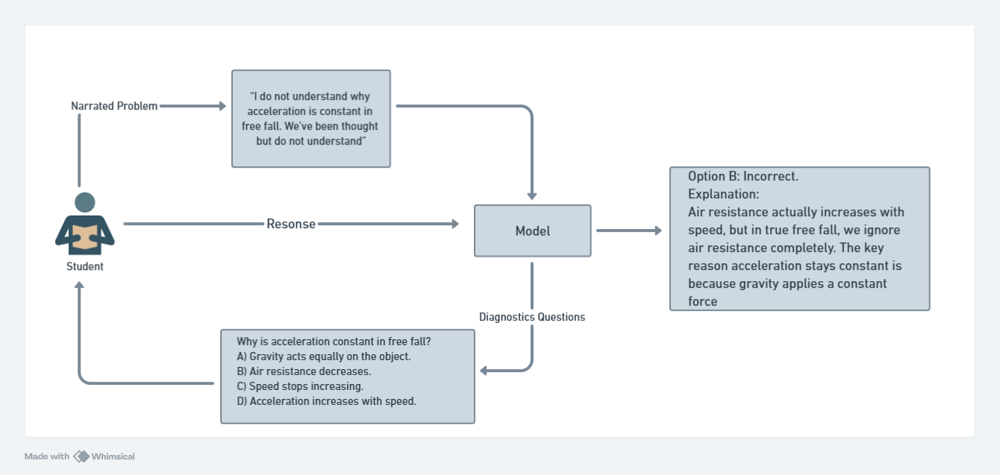
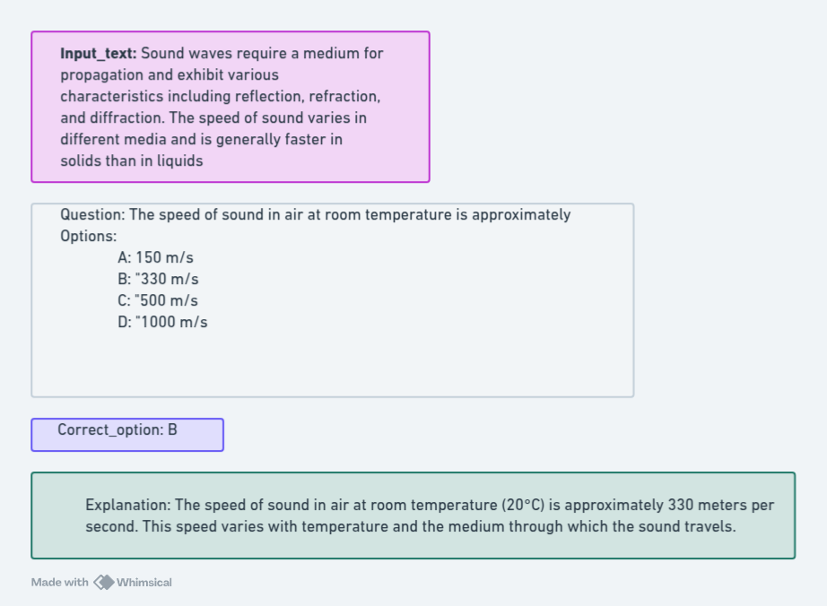
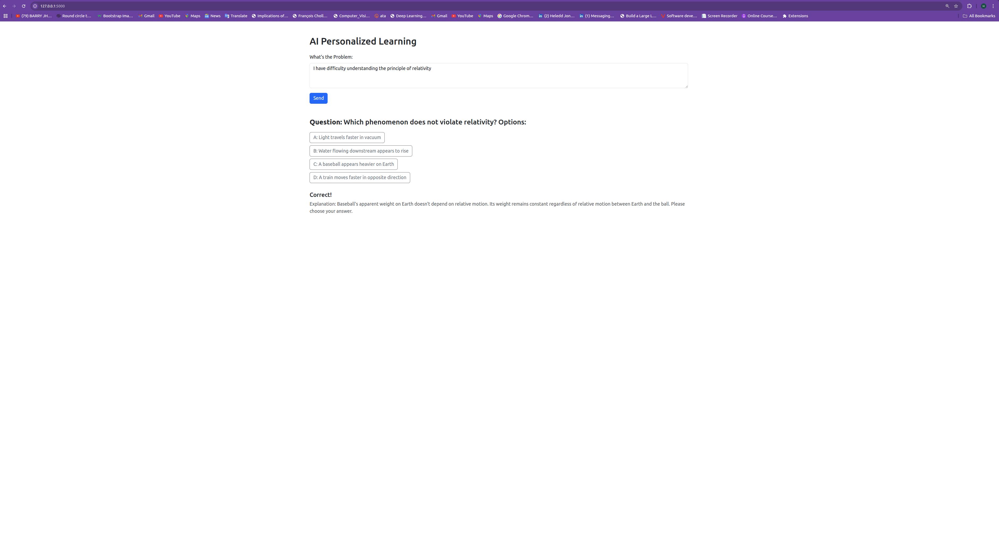

## 🧠 Mitigating Academic Misuse of LLMs Through Formative AI Systems for Personalized Learning Support
This repository supports the research project focused on building an ethical, personalized learning assistant using Large Language Models (LLMs). The goal is to help students understand physics concepts, not simply generate answers, thereby preserving academic integrity and promoting deep learning

## 🔧 What This System Does
- Accepts narrated student prompts describing conceptual struggles
- Generates diagnostic multiple-choice questions to assess understanding
- Evaluates student responses to identify conceptual gaps
- Provides guided explanations, not direct answers
- Supports a wide range of physics topics: mechanics, thermodynamics, electromagnetism, optics, etc.
## 📐 System Design
The model is trained to take structured input and produce diagnostic reasoning. Here's how it works:



## 📁 Dataset Structure
Each entry includes:

A narrated input text

A multiple-choice question

Four answer options

Correct option

An explanatory rationale

Example:



## 🧠 Model Inference
Upon inference



## ⚙️ Model & Training
The LLM was fine-tuned using:

LoRA (Low-Rank Adaptation) for efficient parameter tuning

4-bit quantization to reduce memory load

Supervised instruction fine-tuning on structured university-level physics questions

Physics dataset curated from Federal University of Technology Akure (FUTA) materials

### 📊 Evaluation Results

| Prompting Method | ROUGE-1 F1 | ROUGE-2 F1 | ROUGE-L F1 |
|------------------|------------|------------|------------|
| **Zero-Shot**    | 0.0451     | 0.0196     | 0.0411     |
| **Few-Shot**     | 0.0828     | 0.0322     | 0.0604     |


## Project Folder Structure
```
.
├── App
│   ├── app.py
│   ├── streamlit_app.py
│   ├── stream.py
│   └── templates
│       └── index.html
├── bfg.jar
├── compile.ipynb
├── Data
│   ├── Physics_questions.json
│   └── test_data.json
├── dataset_sample.png
├── Dockerfile
├── Epochs_2
│   └── events.out.tfevents.1744709703.shegun93-DQ67SW.25349.0
├── Epochs_5
│   ├── events.out.tfevents.1745318866.shegun93-DQ67SW.30322.0
│   ├── events.out.tfevents.1745318915.shegun93-DQ67SW.30322.1
│   ├── events.out.tfevents.1745319185.shegun93-DQ67SW.30322.2
│   ├── events.out.tfevents.1745319289.shegun93-DQ67SW.30322.3
│   ├── events.out.tfevents.1745319658.shegun93-DQ67SW.31522.0
│   ├── events.out.tfevents.1745319676.shegun93-DQ67SW.31522.1
│   ├── events.out.tfevents.1745319798.shegun93-DQ67SW.31522.2
│   ├── events.out.tfevents.1745320300.shegun93-DQ67SW.32463.0
│   ├── events.out.tfevents.1745320345.shegun93-DQ67SW.32463.1
│   ├── events.out.tfevents.1745320397.shegun93-DQ67SW.32463.2
│   ├── events.out.tfevents.1745320413.shegun93-DQ67SW.32463.3
│   ├── events.out.tfevents.1745320540.shegun93-DQ67SW.32463.4
│   ├── events.out.tfevents.1745321008.shegun93-DQ67SW.33238.0
│   └── events.out.tfevents.1745321080.shegun93-DQ67SW.33238.1
├── Evaluation.ipynb
├── Images
│   ├── ROUGE_Few.png
│   ├── Zero_shot.png
│   └── ZerovsFew.png
├── inf.png
├── nairs-2d
│   ├── adapter_config.json
│   ├── adapter_model.safetensors
│   ├── README.md
│   ├── special_tokens_map.json
│   ├── tokenizer_config.json
│   ├── tokenizer.json
│   └── training_args.bin
├── nairs-2e
│   ├── adapter_config.json
│   ├── adapter_model.safetensors
│   ├── config.json
│   ├── README.md
│   ├── special_tokens_map.json
│   ├── tokenizer_config.json
│   ├── tokenizer.json
│   └── training_args.bin
├── nairs-fine-tunned.ipynb
├── nairs_merged
│   ├── config.json
│   ├── generation_config.json
│   ├── model-00001-of-00006.safetensors
│   ├── model-00002-of-00006.safetensors
│   ├── model-00003-of-00006.safetensors
│   ├── model-00004-of-00006.safetensors
│   ├── model-00005-of-00006.safetensors
│   ├── model-00006-of-00006.safetensors
│   ├── model.safetensors.index.json
│   ├── special_tokens_map.json
│   ├── tokenizer_config.json
│   └── tokenizer.json
├── nairs-sample-4
│   ├── checkpoint-1164
│   │   ├── adapter_config.json
│   │   ├── adapter_model.safetensors
│   │   ├── optimizer.pt
│   │   ├── README.md
│   │   ├── rng_state.pth
│   │   ├── scheduler.pt
│   │   ├── special_tokens_map.json
│   │   ├── tokenizer_config.json
│   │   ├── tokenizer.json
│   │   ├── trainer_state.json
│   │   └── training_args.bin
│   ├── checkpoint-1358
│   │   ├── adapter_config.json
│   │   ├── adapter_model.safetensors
│   │   ├── optimizer.pt
│   │   ├── README.md
│   │   ├── rng_state.pth
│   │   ├── scheduler.pt
│   │   ├── special_tokens_map.json
│   │   ├── tokenizer_config.json
│   │   ├── tokenizer.json
│   │   ├── trainer_state.json
│   │   └── training_args.bin
│   ├── checkpoint-1552
│   │   ├── adapter_config.json
│   │   ├── adapter_model.safetensors
│   │   ├── optimizer.pt
│   │   ├── README.md
│   │   ├── rng_state.pth
│   │   ├── scheduler.pt
│   │   ├── special_tokens_map.json
│   │   ├── tokenizer_config.json
│   │   ├── tokenizer.json
│   │   ├── trainer_state.json
│   │   └── training_args.bin
│   ├── checkpoint-194
│   │   ├── adapter_config.json
│   │   ├── adapter_model.safetensors
│   │   ├── optimizer.pt
│   │   ├── README.md
│   │   ├── rng_state.pth
│   │   ├── scheduler.pt
│   │   ├── special_tokens_map.json
│   │   ├── tokenizer_config.json
│   │   ├── tokenizer.json
│   │   ├── trainer_state.json
│   │   └── training_args.bin
│   ├── checkpoint-388
│   │   ├── adapter_config.json
│   │   ├── adapter_model.safetensors
│   │   ├── optimizer.pt
│   │   ├── README.md
│   │   ├── rng_state.pth
│   │   ├── scheduler.pt
│   │   ├── special_tokens_map.json
│   │   ├── tokenizer_config.json
│   │   ├── tokenizer.json
│   │   ├── trainer_state.json
│   │   └── training_args.bin
│   ├── checkpoint-582
│   │   ├── adapter_config.json
│   │   ├── adapter_model.safetensors
│   │   ├── optimizer.pt
│   │   ├── README.md
│   │   ├── rng_state.pth
│   │   ├── scheduler.pt
│   │   ├── special_tokens_map.json
│   │   ├── tokenizer_config.json
│   │   ├── tokenizer.json
│   │   ├── trainer_state.json
│   │   └── training_args.bin
│   ├── checkpoint-776
│   │   ├── adapter_config.json
│   │   ├── adapter_model.safetensors
│   │   ├── optimizer.pt
│   │   ├── README.md
│   │   ├── rng_state.pth
│   │   ├── scheduler.pt
│   │   ├── special_tokens_map.json
│   │   ├── tokenizer_config.json
│   │   ├── tokenizer.json
│   │   ├── trainer_state.json
│   │   └── training_args.bin
│   └── checkpoint-970
│       ├── adapter_config.json
│       ├── adapter_model.safetensors
│       ├── optimizer.pt
│       ├── README.md
│       ├── rng_state.pth
│       ├── scheduler.pt
│       ├── special_tokens_map.json
│       ├── tokenizer_config.json
│       ├── tokenizer.json
│       ├── trainer_state.json
│       └── training_args.bin
├── nairs-test.ipynb
├── __pycache__
│   ├── app2.cpython-39.pyc
│   ├── flask.cpython-39.pyc
│   └── streamlit.cpython-39.pyc
├── README.md
├── requirements.txt
├── Result_Inference.png
└── system_design.png

```
## Usage
Clone the repo
```
git clone https://github.com/Shegun93/nairs_paper.git
cd nairs_paper
```
install requirements
```
pip install -r requirements.txt
```

## Key capabilities:

- Generates multiple-choice physics questions

- Provides detailed explanations for correct answers

- Assesses student understanding of physics concepts

- Handles various physics topics (mechanics, thermodynamics, electromagnetism, etc.)
